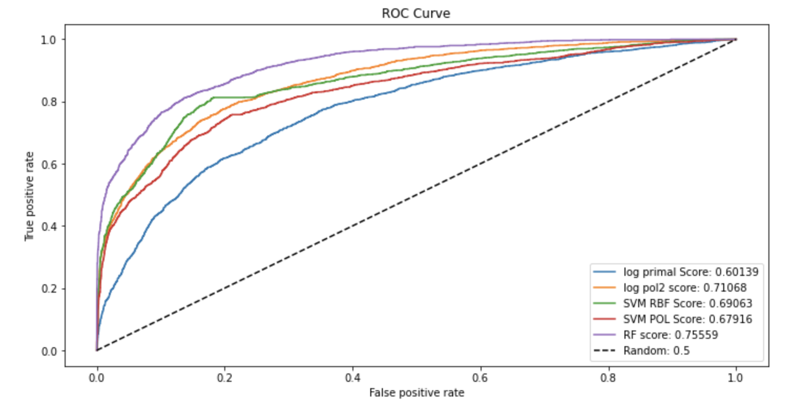

# PREVENTING BANK CUSTOMER CHURN!
Identify and visualize which factors contribute to customer churn.

## Table of Contents
* [General Info](#general-information)
* [Results](Results)
* [Technologies Used](#technologies-used)
* [Contact](#contact)
<!-- * [License](#license) -->

## General Information
- The goal of the project is to predict customer churn
- The models are : 1) LR 2) RF 3) SVM 4) GB
- The project contains 5 steps: 1) introduction 2) Data set review & preparation 3) exploratory data analysis 4) model development and 4) Refinement

## Results

## Technologies Used
- Python
- Scikit learn
- Pandas
- Matplotlib

## Contact
Created by [Miralireza Nabavi](anabavib@asu.edu) - feel free to contact me!
